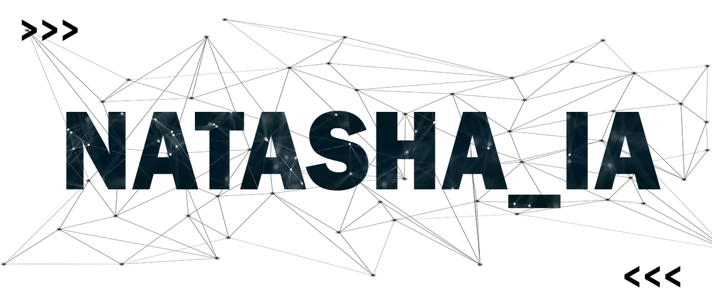

# Natasha_IA
<div>
  🔵IA feita com o objetivo de auxiliar e automatizar determinadas tarefas🔵
  <br>
  <i>Intelligence Artificial Assistent made with the aim of assisting and automating certain tasks</i>
</div>
<div>
  <hr>
  
</div>
<div>
  <h2>SOBRE</h2>
  <p>Natasha é uma assistente virtual inteligente programada com <b>Python</b>, onde reconhece determinados comandos de voz a serem executados. 
    Com o objetivo de automatizar tarefas, ela abranje bibliotecas como <i>Speech Recognition</i>,
    <i>pyttsx3</i>, <i>Pygame</i> e <i>Web Browser</i>, para efetuar os comandos dados pelo usuário; mas podendo possuir várias outras bibliotecas.</p>
  <p>Como um projeto compartilhado simples, Natasha IA é uma versão inicial de futuras atualizações, uma vez que seus primeiros comando principais são básicos e banais. Basta apenas especificar suas ações em seu código fonte para realizar um determinado algoritmo que o usuário irá ordená-la que faça.</p>
</div>
<div>
  <h2>COMO USAR?</h2>
  <p>Um dos primeiros comando de voz simples e importante é o "Natasha, por favor apresente-se"; esse comando irá fazer com que ela se apresente de maneira rápida para o usuário.</p>
  <h3>Como adicionar um novo algoritmo?</h3>
  <p>Em seu código fonte, digite:</p>
  
  ```
  elif "frase_1" in voice_rec.lower() or "frase_2" in voice_rec.lower():
      comando a ser executado
  ```
  <p>Uma vez que a Natasha IA pode ou não reconhecer tal comando de voz (frase_1), sempre é recomendado adicionar uma segunda possibilidade onde a Natasha IA possa entender.</p>
</div>
<div>
  <h2>Como baixar?</h2>
  <p>No Linux OS, é necessário efetuar o download dos requisitos para que o programa seja executado perfeitamente:</p>
  <h3>Instalação</h3>
  
  ```
  git clone https://github.com/BlackHotPepper/Natasha_IA
  ```
  
  <h3>Instalação dos requisitos</h3>
  
  ```
  cd Natasha_IA
  chmod +x *
  pip install -r requirements.txt
  ```
  
  <h3>Execução</h3>
  
  ```
  python3 natasha.py
  ```
  
  <hr>
  
  <p>No Windows OS, você pode baixa-la como um arquivo ZIP, e efetuar a instalação dos requisitos em sua máquina pelo pip:</p>
  
  <h3>Instalação dos requisitos</h3>
  
  ```
  pip install pyttsx3
  pip install SpeechRecognition
  pip install webbrowser
  pip install requests
  pip install pygame
  pip install time
  ```
  
  <p>Após isto, basta executa-la!</p>
  
</div>


